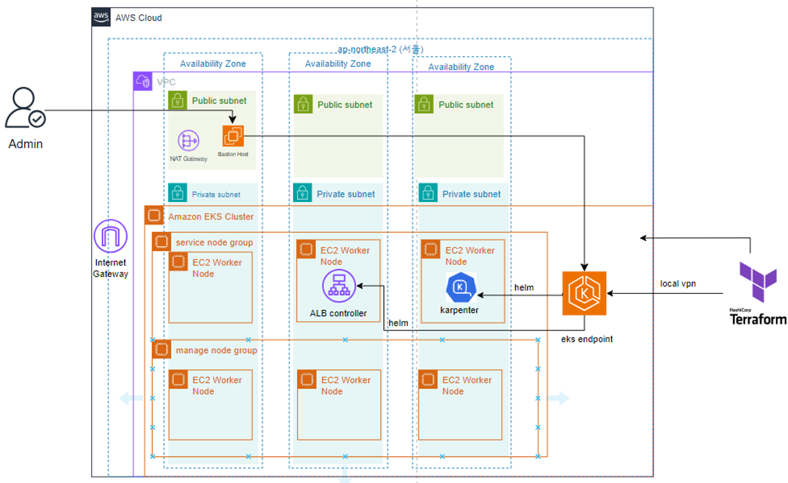
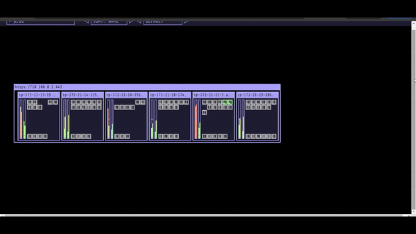

# Cloud Wave project 

본 프로젝트는 이커머스 플랫폼인 올리브영의 트래픽 급증 상황에 대응하는 것을 시나리오로 시작되었다.  

유명 유튜버의 Vlog에 화장품이 노출되면서 예상치 못한 트래픽 급증으로 인해 서버가 다운되는 상황이 발생하였다.  

이러한 문제를 근본적으로 해결하기 위해 MSA(Microservice Architecture) 도입을 시도하는 것으로 결정하였다.  

MSA를 도입하기 위한 핵심 기술로 ISTIO, KAFKA, KARPENTER를 사용하였는데 이 중에서 KARPENTER를 담당했고 그 내용에 대해 적어보고자 한다.  

## 개인 작업 내용 

Cloud wave 3기 프로젝트로 2주동안 개발한 내용을 정리하였다.  

Terraform을 사용하여 EKS 환경 구성하는 작업을 맡았다.  
스케일링을 위해 Karpenter를 사용해야했고 또 외부 접근 엔드포인트를 제공하기 위해 ALB Controller 구성해야했는데 
두 요소 모두 Terraform을 통해 구축하는 것에 성공하였다.  

또 Velero와 Global Accelerator를 이용한 Multi Region DR을 시도하였다.  

## 테라폼 생성 아키텍처  

서울(ap-northeast2)에 가용영역 3개(a,b,c) 각각 Public subnet, Private subnet 생성   
가용영역 a에만 Bastion server용 EIP 생성 또 Nat gateway 생성  
가용영역 a에 RDS 생성할 예정으로 DB전용 Private subnet 생성

EKS, Karpenter, ALB Controller 생성  

사용한 버전은 다음과 같다.  

EKS는 V 1.29 사용하였다.  
Karpenter는 v0.31.3 사용하였다.  
ALB Controller는 AWS ALB Controller 사용하여 Ingress 설정하였다.  

완성된 ALB Controller는 여러 서비스들(ISTIO Dashboard, grafana dashboard, kubecost dashboard)을 접근할 떄 사용되었다.  

기본적으로 EKS Endpoint는 Private IP로 지정 개발 시에는 0.0.0.0으로 올 Ingress 허용하였다.  
실제로 테스트할 때는 VPN IP 사용하여 접근하였다.  

  

## Kube ops view 사용 Karpenter 작동 확인

## 전체 프로젝트 아키텍처

