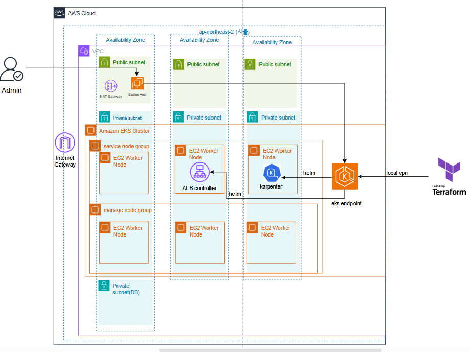
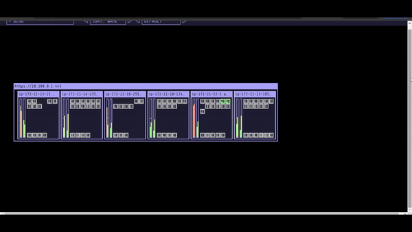
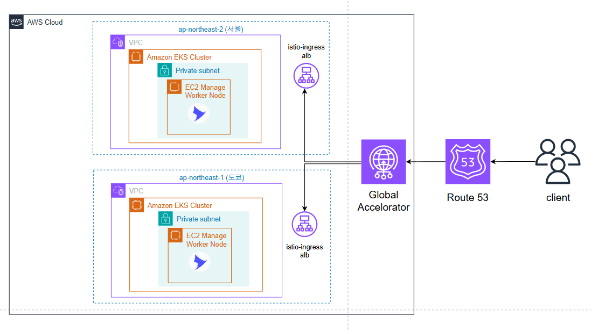
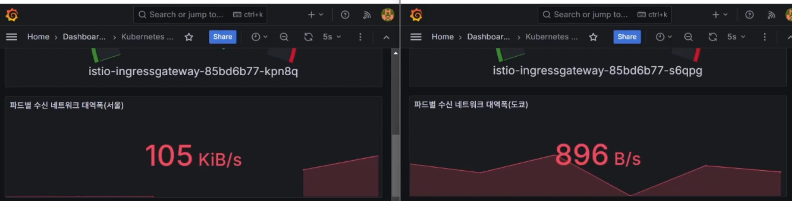
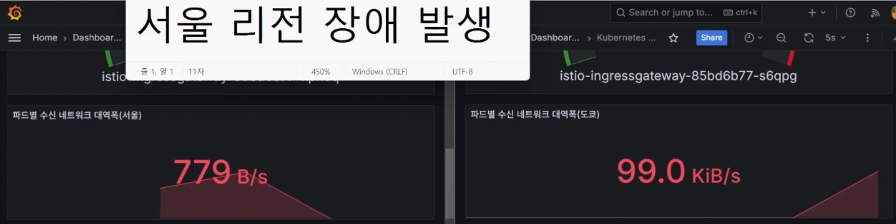
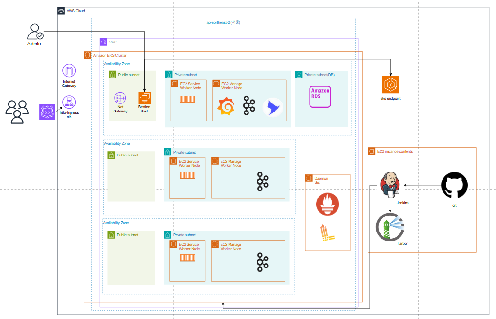

# Cloud Wave project 

본 프로젝트는 Cloud Wave 3기 부트캠프를 진행하며 3주 동안 진행하였습니다.  
이커머스 플랫폼인 올리브영의 트래픽 급증 상황에 대응하는 인프라를 구축하는 것을 목표로 프로젝트를 진행하였습니다.    

MSA를 도입하기 위한 핵심 기술로 ISTIO, KAFKA, KARPENTER를 사용하였고 그 중에서 담당한 내용들에 대해 적어보고자 합니다.   

## 개인 작업 내용 

Terraform을 사용하여 EKS 환경을 구성하는 작업을 맡았습니다.    
노드 스케일링을 위해 Karpenter를 사용했고 또 Ingress gateway를 생성하기 위해 ALB Controller 구성했습니다.   
두 요소 모두 Terraform을 통해 생성했습니다.    

또 Global Accelerator를 이용한 Multi Region DR을 시도하였습니다.   

## 테라폼 생성 아키텍처  

서울(ap-northeast2)에 가용영역 3개(a,b,c) 각각 Public subnet, Private subnet 생성합니다.   
가용영역 a에만 Bastion server용 EIP를 생성하고 또 Nat gateway 생성합니다.  
가용영역 a에 RDS DB 전용 Private subnet을 생성합니다.  

  

## Kube ops view 사용 Karpenter TEST

  

## Multi Region 아키텍처  

  

## Global Accelorator TEST  

Grafana Dashboard를 사용하여 트래픽이 잘 가는지 또 전환이 되는지 확인하였습니다.  

  

## 전체 프로젝트 아키텍처

